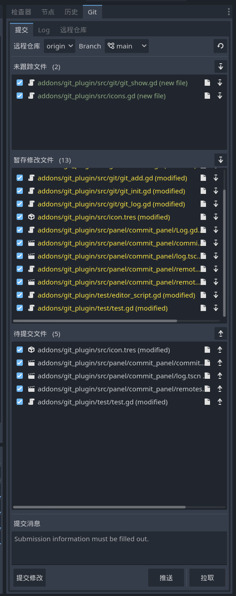
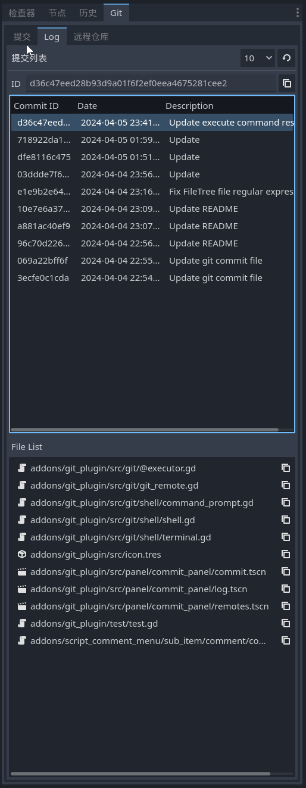

# Godot Simple Git Plugin

---

## Interface

## Contribute

Any contributions is welcome! If you find any bugs, please report in `issues`.

---

> **注意不要有中文的文件名，否则会识别错误**

> git 工具类中，命令如果添加文件时含有 -- 选项，字符串左右需要留有空格
